# Network-Dynamic-Population-Model
## Mo Gibson and Philip Tran

## Setup Instructions

--action [cascade|covid]: either a cascade through a network (like information) or spread of a disease across the network

--initiator m: choose the initial nodes that are infected. Replace m with the node IDs seperated by commas (Ex: 1, 2, 5)

--lifespan l: **covid** number of steps/rounds/days in the whole simulation

--threshold q: **cascade** the minimum percentage in order for a node to switch: (node's neighbors with the new trait) / (total number of nodes) 

--probability_of_infection p: **covid** probability spread to other nodes

--probability_of_death q: **covid** probability death while infected

--infection_duration: **covid** the number of steps someone is infected

--shelter s: **covid** (between 0 to 1) proportion of population that has significantly reduced contact with other nodes (many of their edges are removed/won't work)

--shelter_effectiveness e: **covid** (between 0 to 1) the effectiveness of sheltering (AKA: 1.0 = full isolation, 0.5 = half the total edges aren't in use, 0.0 = no effect)

--vaccination r: **covid** (between 0 to 1) proportion of population that is vaccinated

--vaccination_effectiveness v: **covid** (vac_eff + prob_infect <= 1) for the people that are vaccinated, what is the additional percentage they are not getting infected

--resuceptibility b: (0-1) the likelihood a recover node becomes suceptible again (R -> S)

--interactive: plot a graph and state of nodes for each round

--plot: plot the social network (new infections, deaths, and recoveries) per day

## Sample Command-Line Usage

    python ./dynamic_population.py graph.gml --action cascade --initiator 1,2,5 --threshold 0.33 --plot

Simulates: a cascade with Nodes 1, 2, and 5 as initiators, has a threshold of 0.33, and plots the number of new infections per day

    python ./dynamic_population.py graph.gml --action cascade --initiator 1,2,5 --threshold 0.33 --interactive

Simulates: same as above, but with the interactive feature now

Initial Setup:

Time-stamp 1:

Time-stamp 2:

Time-stamp 3:

Time-stamp 4:

Time-stamp 5:

Time-stamp 6:

    python ./dynamic_population.py graph.gml --action covid --initiator 3,4 --lifespan 5 --probability_of_infection 1.10 --probability_of_death 0.1 --infection_duration 2 --shelter 0.2 --shelter_effectiveness 0.5 --vaccination 0.2 --vaccination_effectiveness 0.5 --resusceptibility 0.5 --interactive

Simulates: a pandemic simulation with Nodes 3 and 4 as initial spreaders, probability of infecting other nodes is 0.10, the infectious stage lasting 2 time-steps, 5-time steps (days) with 10% of the population sheltering in place (reducing contact by half) and 10% of the population vaccinated (decreasing their likelihood of infection by half) (there could be overlap, just like how some people isolate and vaccinate). The following images shows the results.

Initial Setup:
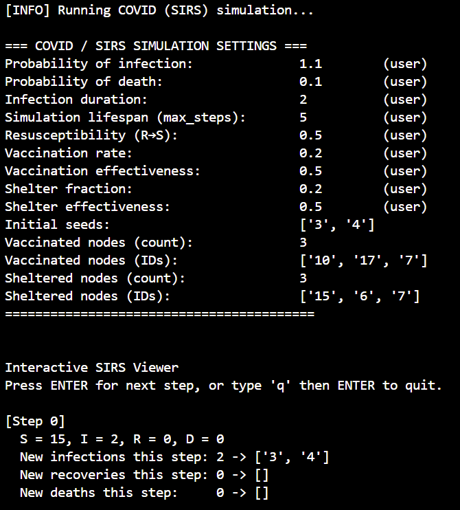
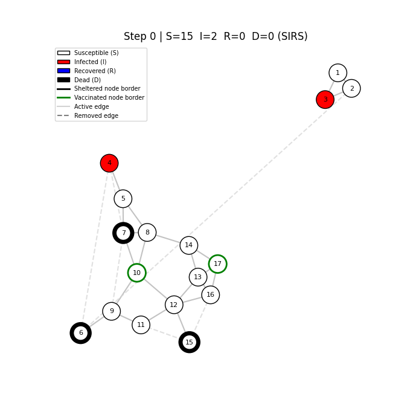

Time-stamp 1:
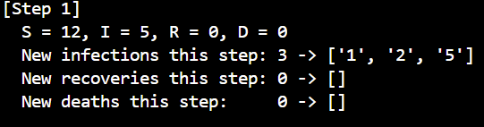
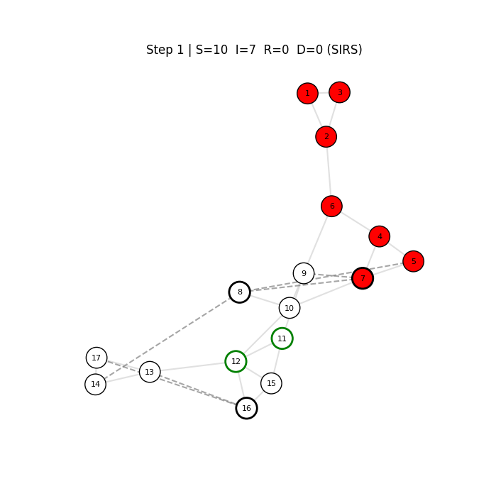

Time-stamp 2:
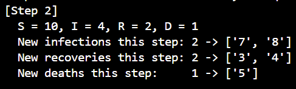
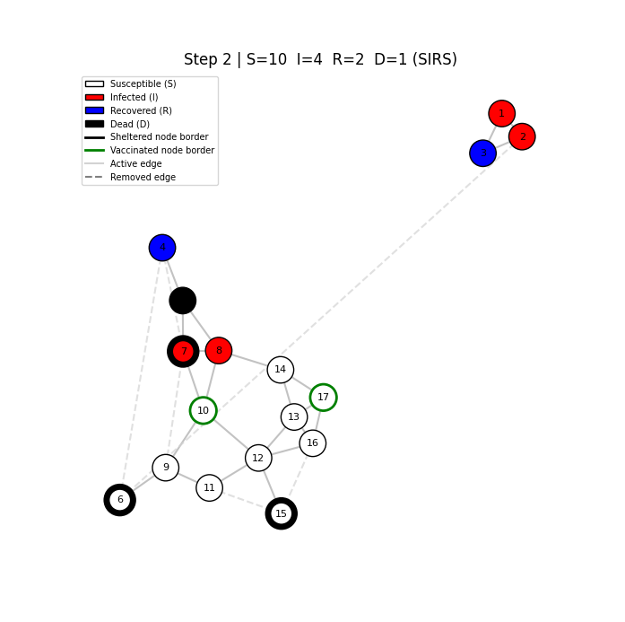

Time-stamp 3:
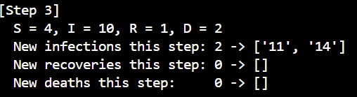
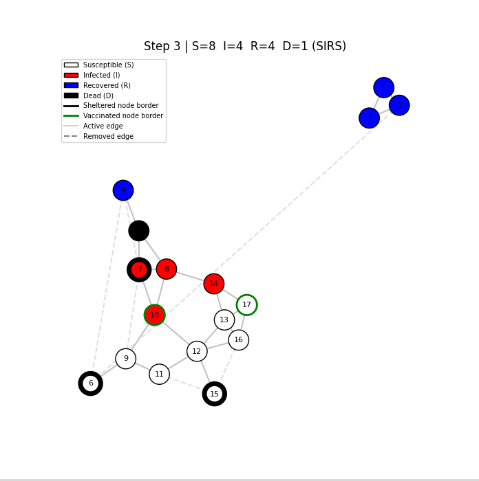

Time-stamp 4:
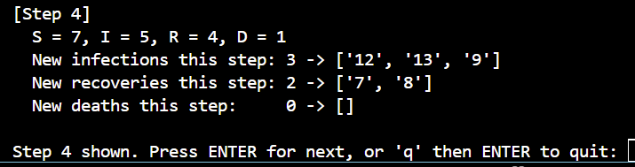
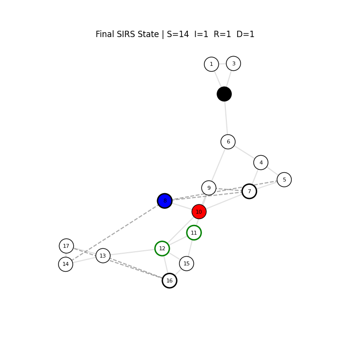

Time-stamp 5:
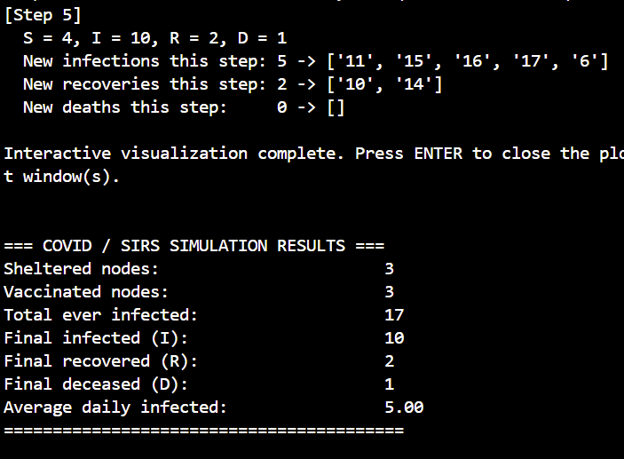

    python ./dynamic_population.py graph.gml --action covid --initiator 3,4 --lifespan 5 --probability_of_infection 1.10 --probability_of_death 0.1 --infection_duration 2 --shelter 0.2 --shelter_effectiveness 0.5 --vaccination 0.2 --vaccination_effectiveness 0.5 --resusceptibility 0.5 --plot

Simulates: same as above, but with the plot feature now

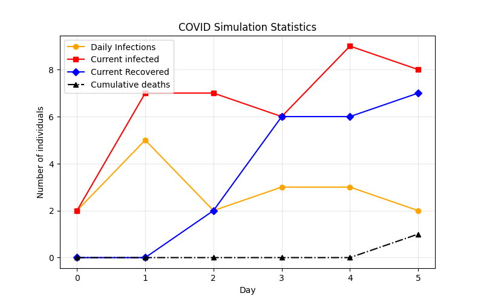
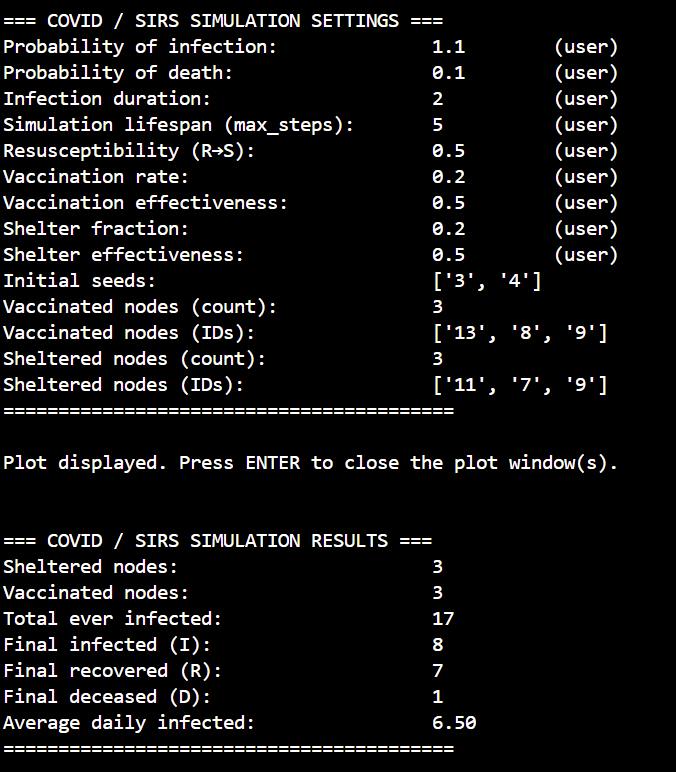

## Explaination of Approach

Our cascade model is very similiar to what we did in class, and models the nodes changing/adopting new ideas because of their neighbors. It does this by comparing the threshold and the percentage of neighbors with the new idea / total neighbors.

The covid model is based on the SIRS model, and has a lot of additional features to test different relationships. This model also includes SID, and the node is permanently cut off from the network (like when people pass away from COVID).

These features are focused on 2 main aspects, the disease's properties and the population's response:
1) Disease properties
- This is probability_of_infection, probability_of_death, infection_duration, and resuceptibility
    - This is the baseline of what the disease will do.

2) Social network reaction
- This is shelter, shelter_effectiveness, vaccination_rate, and vaccination_effectiveness.
    - These are measures that will reduce the spread between nodes

It is easy to track both models either as a whole (with --plot) or on a step-by-step basis