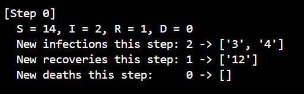
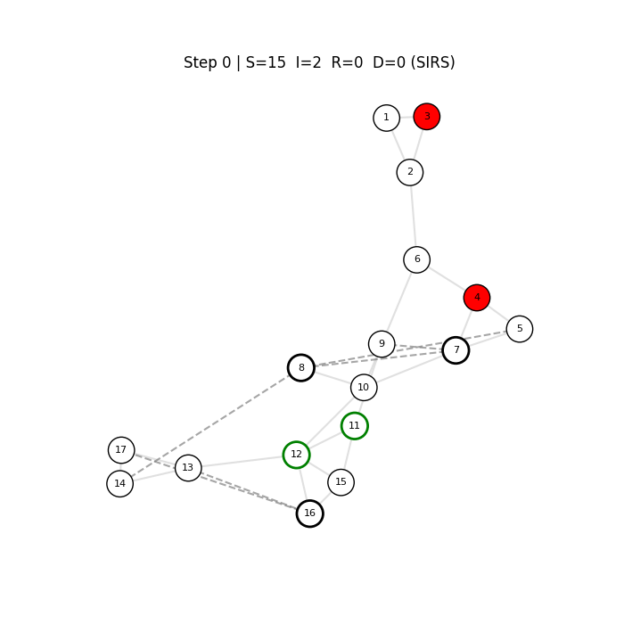
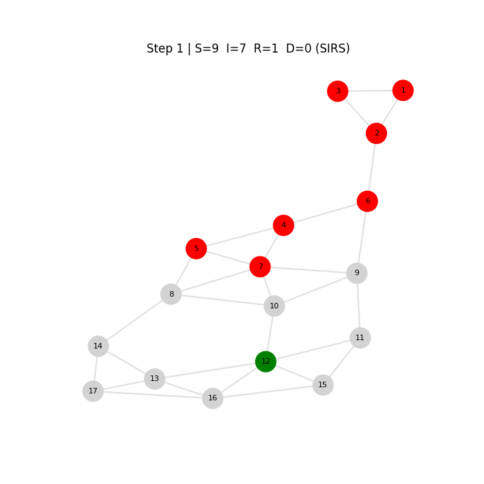
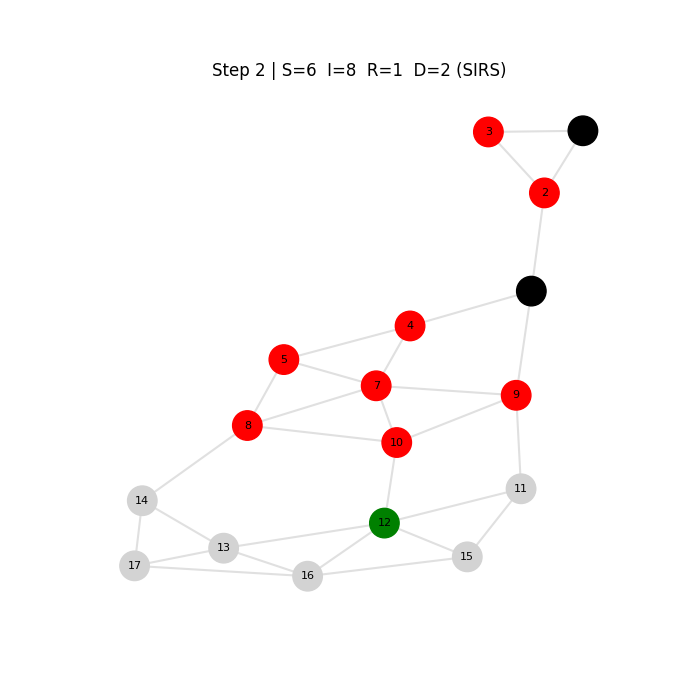
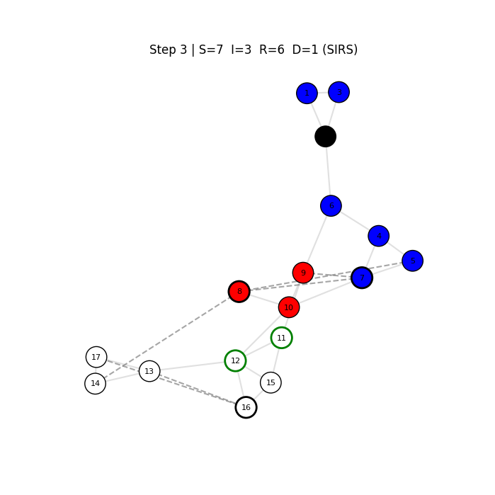
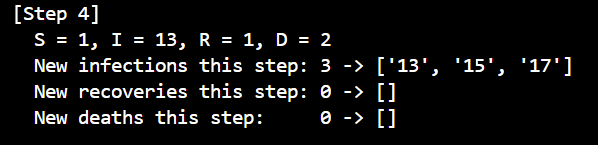
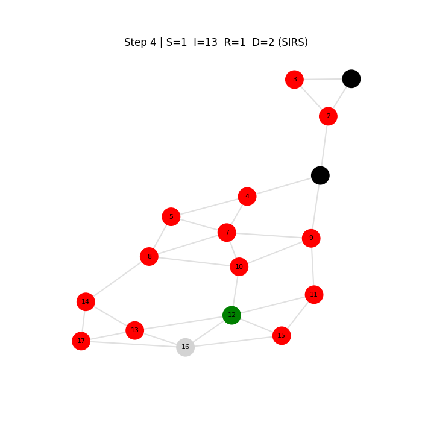
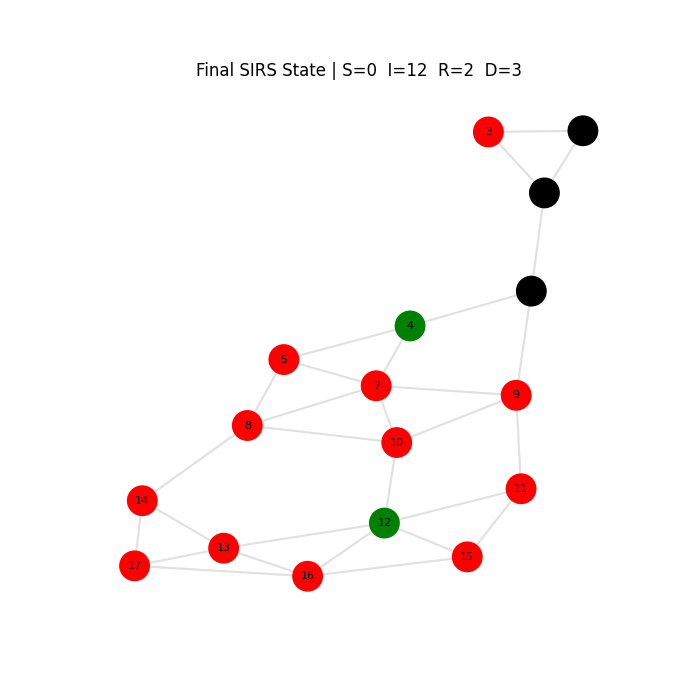

# Network-Dynamic-Population-Model
## Mo Gibson and Philip Tran

## Setup Instructions

--action [cascade|covid]: either a cascade through a network (like information) or spread of a disease across the network

--initiator m: choose the initial nodes that are infected. Replace m with the node IDs seperated by commas (Ex: 1, 2, 5)

--threshold q: *cascade* Set the threshold value of cascade effect

--probability_of_infection p: *covid* probability spread to other nodes

--probability_of_death q: *covid* probability death while infected

--lifespan l: *covid* number of steps/rounds/days

--shelter s: *covid* (between 0 to 1) proportion of population sheltered/protected from infection

--vaccination r: *covid* (between 0 to 1) proportion of population that is vaccinated

--interactive: plot a graph and state of nodes for each round

--plot: plot the number of new infections per day when simulation is

## Sample Command-Line Usage

python ./dynamic_population.py graph.gml --action cascade --initiator 1,2,5 --threshold 0.33 --plot

Simulates: a cascade with Nodes 1, 2, and 5 as initiators, has a threshold of 0.33, and plots the number of new infections per day

python ./dynamic_population.py graph.gml --action covid --initiator 3,4 --probability_of_infection 1.10 --probability_of_death 0.1 --lifespan 5 --shelter 0.10 --vaccination 0.10 --interactive

Simulates: a pandemic simulation with Nodes 3 and 4 as initial spreaders, probability of infecting other nodes is 0.10, the infectious stage lasting 5 time-steps, 5-time steps (days) with 10% of the population sheltering in place and 10% of the population vaccinated (there could be overlap, just like how some people isolate and vaccinate). The following images shows the results.

Initial Setup:

Time-stamp 1:

Time-stamp 2:

Time-stamp 3:

Time-stamp 4:

Time-stamp 5:

## Explaination of Approach

